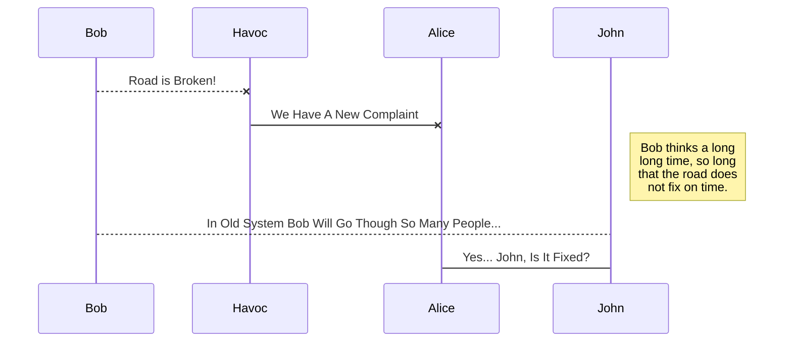
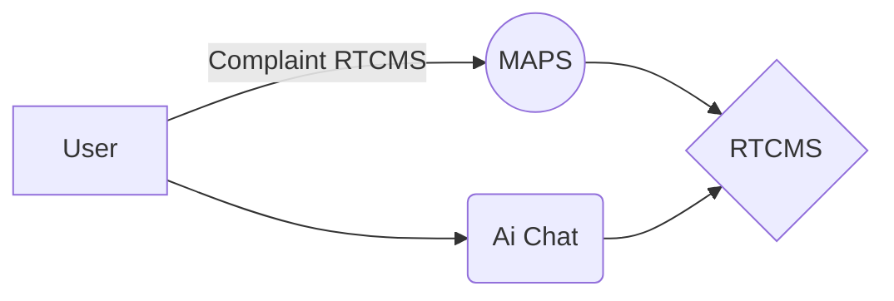

# Welcome to Havoc - City Ai & Realtime Complaint System!

Developed By Abhishek Jha  aka **Speedily**. 
If you want to learn about XRMaps - Its The Internal Name Of Havoc - City Ai and RTCMS, you can read me. 
If you want to play with Markdown, you can edit me. Once you have finished with me, you can create new files by opening the **file explorer** on the left corner of the navigation bar.

# Files

Havoc stores your files in your **public** folder which means all your files are automatically saved locally and are accessible **offline!**

##  Hosting It 

The **Firebase CLI** is freely accessible using terminal in bottom corner of the VSCode Editor. 
You can host a new file by writing the **firebase deploy --only hosting** command in the terminal. 

## Switch to local dev

All your files can be run in local environment using **firebase serve** . You can switch from one to another by clicking a file in the tree.

## Why Havoc?

Havoc converts complaints into "smart" data entities for faster action. For example:

|                |Traditionsl                    |Havoc                        |
|----------------|-------------------------------|-----------------------------|
|Lodging A Complaint| No Easy Way            | Realtime            |
|Ai City Guide         |`"$25/mo + Addons"`   |"$0/Mo"            |
|Fixing Time         |`Upto 7 Months`| 7 Days|

## UML diagrams

You can render UML diagrams using [Mermaid](https://mermaidjs.github.io/).   a sequence diagram:

And  a flow chart:

